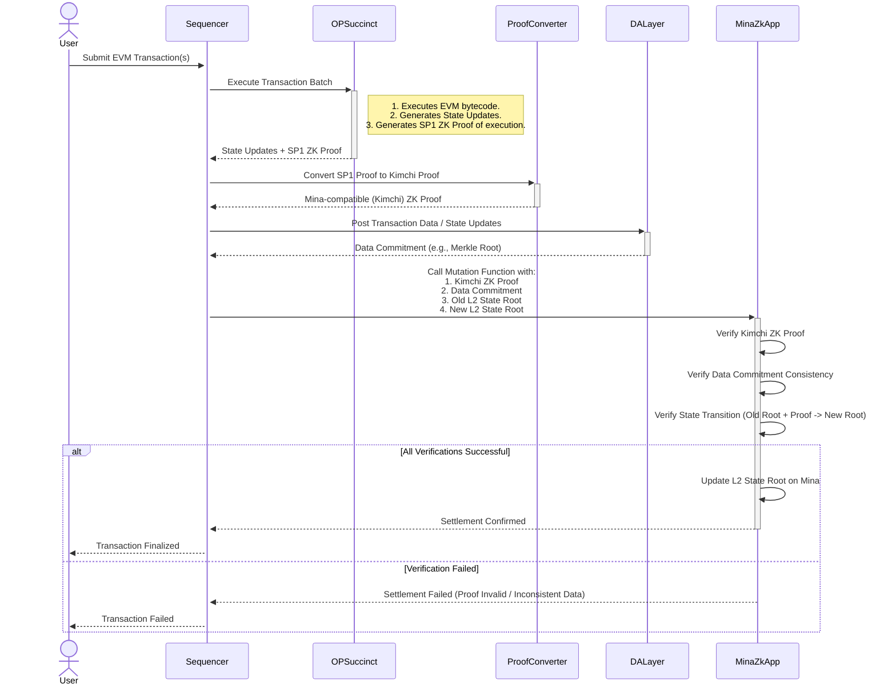

# Enabling Solidity Smart Contracts on Mina: A ZK Rollup Approach

## Introduction

Mina is not natively EVM compatible, hence smart contracts on Ethereum are not equivalent to smart contracts on Mina. To achieve this, we have 2 main approaches,

1.  convert Solidity smart contracts into a compatible Mina format, such that they can be run in Mina smart contracts, or
2.  create verifiable proofs that certify the execution of Solidity smart contracts, in some EVM environment

This document explores the second approach in detail.

## Main Approach: Generating EVM execution proof

Instead of performing the EVM logic in a zk program, we can make use of zkEVMs to generate a proof of EVM execution. This means that Smart contract storage needs to be managed by a separate network / set of actors, similar to an Ethereum L2.

This approach can be described as a centralized sequencer ZK rollup. A single sequencer will receive incoming smart contract interactions and sequence them, with some arbitrary block time. These transactions are run inside a zkEVM (like `op-succinct` which leverages SP1), and commitments for the final state and transaction calldata, along with a zero-knowledge proof of the state transition, are submitted to a zkApp on Mina.

The proofs generated by the zkEVM (e.g., SP1 proofs from `op-succinct`) are not directly compatible with Mina's native Kimchi proving system. Therefore, these proofs must be converted. The Nori-zk SDK is a candidate for converting SP1 PLONK proofs to Mina-compatible Kimchi proofs. To ensure users can verify transactions and reconstruct state independently of the sequencer, raw transaction calldata (or state diffs) is posted to a Data Availability (DA) layer like Celestia.

This ZK rollup approach is chosen for this project. The core components and workflow are detailed below.

### Core Architecture: ZK Rollup

The ZK rollup architecture ensures that all state transitions are validated on Mina using zero-knowledge proofs before being finalized.

1.  **Custom Sequencer and Execution/Proof Generation with `op-succinct`**
    *   **Sequencer Role**: A dedicated sequencer acts as the entry point for Ethereum-like transactions via an RPC endpoint. It is responsible for receiving transactions, ordering them, and orchestrating the process of execution, proof generation, data availability, and settlement on Mina.
    *   **`op-succinct` for Execution and Proving**: We chose `op-succinct` to handle the EVM execution and initial zero-knowledge proof generation.
        *   **Why `op-succinct`?** `op-succinct` is a proving engine for the OP Stack, leveraging SP1, a high-performance, general-purpose zkVM. It supports validity proofs and aims to enable a type-1 zkEVM rollup.
        *   **Range and Aggregation Proofs**: `op-succinct` works by:
            1.  Generating **range proofs**: These prove the correct state transition for a *range* of L2 blocks/transactions.
            2.  Generating **aggregation proofs**: These proofs combine multiple range proofs into a single, succinct proof that attests to the validity of a larger sequence of state transitions. This aggregated proof is the one that, after conversion, will be submitted to the Mina zkApp.

2.  **Data Availability (DA) Layer with Celestia**
    *   **Rationale**: To keep the Mina chain light and transaction costs manageable, full transaction data (or state diffs) isn't stored directly on Mina. Instead, it's posted to a dedicated Data Availability layer like Celestia. This approach is common in modular blockchain designs.
    *   **Process**: The sequencer posts the transaction data (or state diffs resulting from execution within `op-succinct`) to the DA layer. The DA layer provides a commitment (e.g., a Merkle root or blob reference) for this data. This commitment becomes a public input to the Mina zkApp and is linked to the ZK proof.

3.  **Proof Conversion (e.g., SP1 to Kimchi via Nori-zk)**
    *   The aggregated ZK proof generated by `op-succinct` (an SP1 proof) needs to be verifiable by the zkApp on Mina, which uses the Kimchi proof system.
    *   The sequencer will manage this conversion. A tool like the Nori-zk SDK can be used to convert the SP1 PLONK proof into a Mina-compatible Kimchi proof. This converted proof is then submitted to the zkApp. To keep things efficient, we leverage SP1's Prover Network to generate the zkEVM execution proof.

4.  **Settlement on Mina with zkApp Verification**
    *   **zkApp Design**: A custom zkApp, written in o1js, is deployed on the Mina blockchain. This zkApp acts as a stateful registry, holding the current L2 state root, a commitment to the latest valid ZK proof that established this root, and the corresponding data commitment from the DA layer.
    *   **Mutation Function**: The sequencer interacts with the zkApp by calling a specific "mutation function."
    *   **Inputs to the Mutation Function**:
        1.  The **converted (Kimchi) aggregated ZK proof**. This proof attests to a valid EVM state transition from an old L2 state root to a new L2 state root.
        2.  The **data commitment** (e.g., Merkle root) from the DA layer, corresponding to the transactions included in the scope of the proof.
        3.  The **new L2 state root** (the proposed new state, claimed by the sequencer and validated by the ZK proof).
        4.  The **old L2 state root** (which the zkApp already stores and uses to verify the transition).
    *   **Verification Logic (within the Mutation Function)**: The zkApp performs rigorous on-chain verification:
        1.  **Verify Converted ZK Proof**: The zkApp directly verifies the submitted (Kimchi) aggregated ZK proof. This cryptographically guarantees that the state transition from the previous L2 state root to the new L2 state root is valid according to EVM rules.
        2.  **Verify Data Commitment Consistency**: The zkApp ensures that the data commitment (from the DA layer) provided by the sequencer is consistent with the public inputs of the verified ZK proof. This links the proven state transition to the actual transaction data made available on the DA layer.
        3.  **State Transition Check**: The zkApp confirms that the ZK proof correctly attests to the transition from the `previous L2 state root` (already stored in the zkApp) to the `new L2 state root` being proposed.
    *   **Settlement (State Update on Mina)**: If all verifications within the zkApp's mutation function pass successfully:
        *   The zkApp updates its internal state to store the **new L2 state root**, making it the canonical state of the rollup on Mina.
        *   It may also update its record of the "current ZK proof" to a commitment of the newly verified aggregated proof.
        *   It updates its stored "data commitment" to the new data commitment from the DA layer.
        This action finalizes the rollup's batch state on the Mina blockchain with strong cryptographic guarantees. If any verification step fails, the mutation function rejects the update, and the L2 state remains unchanged.

### Sequence Diagram for ZK Rollup

This diagram illustrates the interaction between the components in the ZK Rollup.

### zkApp Design and Implementation

The on-chain settlement layer is essentially a smart contract, called `SettlementContract`.

#### `SettlementContract`

This is the stateful smart contract deployed on Mina. Its primary role is to maintain the canonical state of the L2 rollup.

*   **On-Chain State**: The contract stores three `Field` elements:
    *   `latestL2StateRoot`: The Merkle root of the L2 state.
    *   `latestProofCommitment`: A commitment to the external ZK proof that validated the latest state transition.
    *   `latestDACommitment`: The commitment from the Data Availability layer.
*   **Update Mechanism**: The contract exposes an `update` method that can only be called with a valid `StateTransitionProof`. The `update` method verifies that the proof's starting state matches the contract's current state, and if valid, updates the on-chain state to reflect the new state from the proof.

#### `StateTransitionVerifier`

This is a zk program that is responsible for generating the proofs that the `SettlementContract` consumes. It defines the valid state transitions for the rollup.

*   **Recursive Structure**: The core logic is in the `updateState` method, which is recursive. It takes a proof of the *previous* state transition (`SelfProof`) as one of its inputs. This creates a chain of proofs, where each new state is proven to be a valid transition from the last.
*   **State Transition**: The program's public input is a `StateTransition` struct, which contains the `previousState` and `newState` of the rollup.
*   **Verification Logic**: Inside the zk program, it performs several checks:
    1.  Verifies the `SelfProof` of the previous state transition.
    2.  Asserts that the `previousState` in the public input matches the `newState` from the `SelfProof`.
    3.  Asserts that the `previousL2StateRoot` from the external proof inputs matches the current `latestL2StateRoot`. This ensures the external proof was generated for the correct state.
    4.  It constructs the `newState` from the verified external inputs.

## Alternative Approach: Solidity Smart Contract Conversion

What we essentially need to do, is to re-create an EVM environment using zk programs. This means that we would need to replicate the following structures necessary for a simple virtual machine,
1.  stack,
2.  memory,
3.  storage (transient storage as well),
4.  program counter, and
5.  operations (opcodes)

Now, we have a state transition function encoded in a zk program.

So, incoming Ethereum smart contract interactions are translated into a list of opcodes, which are then passed into the state transition function (along with the existing storage values), and the outcome of the transaction is returned to the user.

However, since gas on Mina is not dynamic relative to operations inside a transaction, one can imagine that the state size can be griefed by continually expanding it with constant cost transactions. Hence, without some off-chain solution for storage (i.e. using some commitment to represent storage + some DA layer for values), some additional fee mechanism needs to be designed.

This approach naturally requires extensive work and rigorous testing, as it involves creating a VM in zk programs, which is why the other approach is adopted.

## Further Considerations

### Why Single Sequencer vs Multiple Sequencers?

At this current stage, shared / multiple sequencer is not a priority, but it does improve the security of the network. One simple way to achieve this is to have a pre-defined set of actors (e.g. O1 Labs, Mina Foundation) running the sequencer, and rotate leaders in a deterministic fashion.

Each sequencer needs to be able to run the proof conversion from SP1 to Kimchi, which naturally increases hardware requirements.

### What stage of zkEVM is this?

L2beat has a [framework](
https://medium.com/l2beat/introducing-stages-a-framework-to-evaluate-rollups-maturity-d290bb22befe) to evaluate the maturity of zkEVMs, which is a good reference to see where we are at.

The final goal of this project is to reach stage 2, where the settlement logic is done in the zkApp, and the sequencer only needs to post the transaction data to the DA layer.

### Light Clients

A natural question to raise is, how does one verify the correctness of the sequencer? Here is where light clients come in. Because the transaction calldata is posted to the DA layer, one can verify the correctness of the sequencer by retrieving the block data, then run it through SP1 to generate a PLONK proof. This proof can then be converted with Nori-zk, and verified with the zkApp.

## Dependencies

### `op-succinct`

zkEVM of the OP Stack, which [has been audited](https://succinctlabs.github.io/op-succinct/faq.html?highlight=audit#has-op-succinct-been-audited).

### `Nori-zk`

Converts SP1 PLONK proofs to Mina-compatible Kimchi proofs, which is not yet audited.

### `sp1` Prover Network

Using the Prover Network requires tokens, which needs to be continuously supplied to make sure that the proof generation can run within a reasonable time.

### `Celestia` (DA layer)

Uploading data blobs to Celestia requires the use of `BlobTx` on the network, which requires some tokens.

## Conclusion

By leveraging a custom zkEVM like `op-succinct` for execution and using Nori-zk to make the proofs compatible, this architecture aims to provide verifiable and scalable execution of EVM-compatible logic within the Mina ecosystem.

